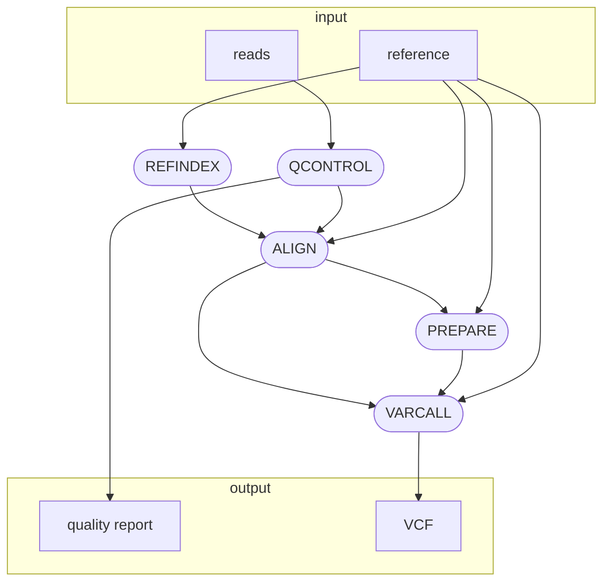

# deepvariant

This repository contains a Nextflow variant calling pipeline for analyzing Next-Generation Sequencing (NGS) data using [deepvariant](https://github.com/google/deepvariant).



## Description

The pipeline is implemented in Nextflow and includes several stages for NGS data analysis:

1. **REFINDEX:** Index creation using BWA (Burrows-Wheeler Aligner).
2. **QCONTROL:** Data preprocessing using Fastp.
3. **ALIGN:** Sequence alignment using BWA mem.
4. **PREPARE:** File processing and preparation using Samtools.
5. **VARCALL:** Variant calling using deepvariant.

## Usage

### Quick Start

To quickly run the pipeline, use the following command:

```bash
nextflow run glebus-sasha/deepvariant \
-profile <docker/singularity> \
--reference <path-to-reference>\
--reads <path-to-reads-folder>\
--outdir results
```

### Requirements

- Nextflow (https://www.nextflow.io/docs/latest/install.html)
- Docker (https://docs.docker.com/engine/install/) or
Singularity (https://docs.sylabs.io/guides/3.0/user-guide/installation.html)

### Running the Pipeline

1. Install all the necessary dependencies such as Nextflow, Singularity.
3. Clone this repository: `git clone https://github.com/glebus-sasha/deepvariant.git`
4. Navigate to the pipeline directory: `cd deepvariant`
5. Edit the `nextflow.config` file to set the required parameters, if necessary.
6. Run the pipeline, setting the required parameters, for example:

```bash
nextflow run main.nf
```

## License

This project is licensed under the [MIT License](LICENSE).
